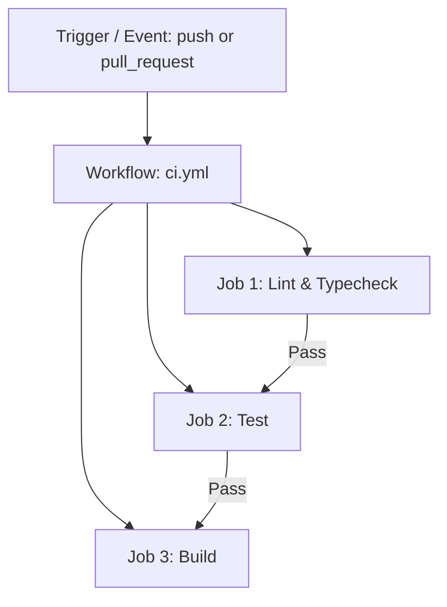

# 🚀 Ultimate CI/CD & GitHub Actions Guide for Next.js

Welcome! Is guide main hum **CI/CD (Continuous Integration & Continuous Deployment)** ko practical tarike se samjhenge ke ye kya hai, kyun zaroori hai, aur GitHub Actions ke zariye hum automated workflows kaise banate hain.

---

## 💡 What is CI/CD? (CI/CD Kya Hai?)

### 1. **Continuous Integration (CI) - Musalsal Tashkhees**
CI ka matlab hai jab bhi aap ya aap ki team code mein koi tabdeeli (commit/pull request) karti hai, toh automated system:
- Code ko test karta hai (`npm test`)
- Syntax & Style check karta hai (`npm run lint`)
- Type safety verify karta hai (`tsc --noEmit`)
- Build verify karta hai (`npm run build`)

**Fayda**: Ghalat ya broken code kabhi main branch mein merge nahi hota.

### 2. **Continuous Deployment (CD) - Musalsal Tarseel**
CD ka matlab hai jab CI pass ho jaye aur code main branch mein merge ho jaye, toh system automatically aap ki application ko live production server (e.g. GitHub Pages, Vercel, AWS, Netlify) par deploy kar deta hai.

**Fayda**: Manual deployment ki zaroorat nahi rehti. Every push = instant live update.

---

## 🛠️ GitHub Actions Architecture

GitHub Actions mein workflow ke 4 main pillars hote hain:



1. **Workflow**: Top-level automation process (.yaml file saved in `.github/workflows/`).
2. **Event (Trigger)**: Event jo workflow ko start karta hai (e.g. `on: push`, `on: pull_request`, `on: schedule`).
3. **Jobs**: Set of steps executed on a runner (server). Jobs parallel mein chal sakti hain ya sequential (`needs: job_name`).
4. **Steps**: Individual tasks in a job (e.g. running shell commands `run: npm test` or using pre-built actions `uses: actions/checkout@v4`).

---

## 📑 Breakdown of `ci.yml` File

Lines and keywords explained in detail:

```yaml
name: Continuous Integration (CI) Pipeline  # Workflow ka naam UI mein show hone ke liye

on:
  push:
    branches: [ main, master ]              # Main branch par push hone par chalega
  pull_request:
    branches: [ main, master ]              # Pull request open hone par chalega

jobs:
  lint-and-typecheck:
    name: 🔍 Lint & Type Check
    runs-on: ubuntu-latest                  # Ubuntu Linux virtual machine par run hoga

    steps:
      - name: 📥 Check out repository code
        uses: actions/checkout@v4           # Repo code ko VM par clone karne ke liye

      - name: 🟢 Setup Node.js environment
        uses: actions/setup-node@v4           # Node.js install aur cache configure karne ke liye
        with:
          node-version: 22
          cache: 'npm'                       # npm modules cache karta hai taake fast build ho

      - name: 📦 Install dependencies
        run: npm ci                          # Fast clean install for CI environments

      - name: 🎨 Run ESLint check
        run: npm run lint                    # Code formatting check

      - name: 🛡️ Run TypeScript type check
        run: npx tsc --noEmit                # Types verification without generating js
```

---

## 📑 Breakdown of `deploy.yml` File (Continuous Deployment)

```yaml
name: Continuous Deployment (CD) Pipeline

on:
  push:
    branches: [ main, master ]
  workflow_dispatch:                         # Button trigger in GitHub UI

permissions:                                  # GitHub token ko deployment permissions
  contents: read
  pages: write
  id-token: write

jobs:
  deploy:
    runs-on: ubuntu-latest
    steps:
      - uses: actions/checkout@v4
      - uses: actions/setup-node@v4
        with:
          node-version: 22
          cache: 'npm'
      - run: npm ci
      - run: npm run build                    # Next.js static output generate karta hai (`out/`)
      - uses: actions/upload-pages-artifact@v3
        with:
          path: ./out
      - uses: actions/deploy-pages@v4         # Live site deploy ho jati hai
```

---

## 🎓 Hands-On Learning Tasks (Aap Kaise Practice Kar Sakte Hain?)

1. **Push your code to GitHub**:
   ```bash
   git add .
   git commit -m "feat: setup next.js app with ci/cd workflows"
   git push origin main
   ```
2. **Check GitHub Actions Tab**:
   - Go to your GitHub repository -> **Actions** tab.
   - Aap dekhenge ke `Continuous Integration (CI) Pipeline` aur `Continuous Deployment (CD) Pipeline` automatic run ho rahe hain!
3. **Intentional Test Failure Practice**:
   - Make a syntax error or failing test locally.
   - Push to a feature branch and open a PR.
   - Observe how GitHub Actions blocks merging until you fix the issue.

---

## ⚡ Next.js `next.config.ts` for Static Export (GitHub Pages)

To enable static deployment on GitHub Pages, update `next.config.ts`:

```typescript
import type { NextConfig } from "next";

const nextConfig: NextConfig = {
  output: "export", // Enables static HTML export in out/ folder
  images: {
    unoptimized: true, // Required for GitHub Pages static export
  },
};

export default nextConfig;
```

---

## 🚨 Troubleshooting: `Failed to create deployment (status: 404)`

Agar CD Workflow run hone par 404 error aaye:

> `Error: Failed to create deployment (status: 404)`

### 🛠️ Solution (Hal):
GitHub security reason ki wajah se direct actions deployment allow nahi karta jab tak aap enable na karein.

1. Apne GitHub repository ki **Settings** par jayein:  
   👉 [https://github.com/abdullahwebdev9176/github-actions-playground/settings/pages](https://github.com/abdullahwebdev9176/github-actions-playground/settings/pages)
2. **Build and deployment** section ke under **Source** ka dropdown kholein.
3. Change **Source** from `Deploy from a branch` ➔ **`GitHub Actions`**.
4. Save karein aur GitHub Actions tab mein ja kar **Re-run all jobs** button par click karein!

